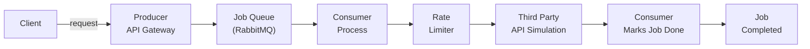

# API Queue Manager



**API Queue Manager** is a distributed, Rust-based system that manages and queues API requests to third-party APIs. It leverages RabbitMQ to queue and process requests asynchronously, ensuring that third-party APIs are not overwhelmed by requests and respecting any rate limits.

The system includes:

- A **Producer** that queues incoming requests.
- A **Consumer** that processes queued requests and communicates with third-party APIs.
- An **API simulation** (written in Go) with rate limiting to test the full pipeline.

## Features

- Handles various types of HTTP requests (GET, POST, PUT, DELETE)
- Queues requests and processes them asynchronously using RabbitMQ
- Built with Rust and Axum for high performance and reliability
- **Go-based API simulation** to test rate limiting and retries
- API rate-limiting simulation with retries and exponential backoff
- Uses Docker and Docker Compose for easy deployment and development
- Error handling and retry mechanism for failed or rate-limited requests

## Prerequisites

- [Docker](https://docs.docker.com/get-docker/) and [Docker Compose](https://docs.docker.com/compose/install/)
- Rust (if you plan to run the services locally without Docker)

## Getting Started

Follow these steps to set up and run the project using Docker Compose.

### 1. Clone the Repository

```bash
git clone https://github.com/yourusername/api-queue-manager.git
cd api-queue-manager
```

### 2. Build and Run the Services

Run the following command to build and start all services (RabbitMQ, producer, consumer, and API simulation) using Docker Compose:

```bash
docker-compose up --build
```

This command will start:

- RabbitMQ (message broker)
- **Producer** (API gateway to handle user requests and enqueue them)
- **Consumer** (processes jobs from the queue and communicates with third-party APIs)
- **API simulation** (Go-based rate-limited API for testing)

### 3. Testing the Flow

#### Testing with cURL:

You can simulate a request by sending a POST request to the **Producer** service:

```bash
curl -X POST http://localhost:3000/request -H "Content-Type: application/json" -d '{"method": "GET", "endpoint": "http://api-simulation:8080/", "payload": null}'
```

This request will be added to the **RabbitMQ** queue, and the **Consumer** will process it.

### 4. Monitoring RabbitMQ

To monitor RabbitMQ, you can access the RabbitMQ Management UI at:

```bash
http://localhost:15672
```

- Username: `guest`
- Password: `guest`

In the **Queues** section, you will see the `api_requests` queue where requests are being enqueued by the Producer and dequeued by the Consumer.

### 5. API Simulation and Rate Limits

The `api-simulation` service (written in Go) is a simple HTTP server with a built-in rate limiter. It simulates a real third-party API that can only handle a limited number of requests per minute (configured in the `api-simulation` service).

- By default, the rate limiter allows **10 requests per minute**. If more requests are sent, the simulation returns an HTTP 429 ("Too Many Requests") response.
- The **Consumer** will retry failed requests when it hits the rate limit. It uses exponential backoff to delay retries.

#### Testing Rate Limits:

Run the provided `send_requests.sh` script to simulate multiple requests and observe how the system handles rate limiting and retries:

```bash
./send_requests.sh
```

This script sends multiple requests to the Producer, which enqueues them in RabbitMQ. The Consumer will process these requests and retry when rate limits are hit.

### 6. Project Structure

```
api-queue-manager/
├── api-simulation/   # Go-based rate-limited API simulation
│   ├── cmd/          # Main application entrypoint
│   ├── internal/     # Rate limiter and HTTP server implementation
│   └── pkg/          # Utilities for the Go server
├── consumer/         # Rust-based RabbitMQ consumer
│   └── src/
├── producer/         # Rust-based API gateway and RabbitMQ producer
│   └── src/
├── models/           # Shared models between producer and consumer
├── Dockerfile        # Dockerfile for the Producer and Consumer
├── compose.yaml      # Docker Compose file to orchestrate all services
└── send_requests.sh  # Script to send multiple requests for testing
```

- **Producer**: Accepts HTTP requests and adds them to the RabbitMQ queue.
- **Consumer**: Consumes jobs from RabbitMQ, makes requests to the third-party API, and handles rate-limiting by retrying failed requests.
- **API Simulation**: Simulates a third-party API with rate limits for testing.
- **RabbitMQ**: Message broker that handles the job queue between the producer and consumer.

### 7. License

This project is licensed under the MIT License. See the [LICENSE](LICENSE) file for details.

### 8. Acknowledgments

- [Axum](https://github.com/tokio-rs/axum) for providing an ergonomic HTTP server framework for Rust.
- [Rust Programming Language](https://www.rust-lang.org/) for making system programming safe and fun.
- [Golang](https://golang.org/) for its simplicity in building the API simulation.
