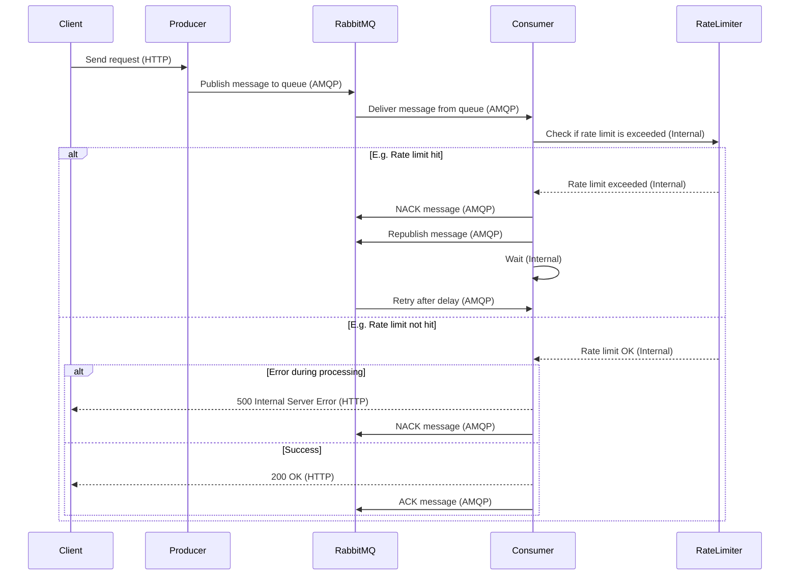

# API Queue Manager

This is a distributed system that manages and queues API requests to third-party APIs. It uses RabbitMQ to handle requests asynchronously, ensuring that the third-party APIs are not overwhelmed, while respecting rate limits.



## Features

- **Request Queueing:** Handles HTTP requests (GET, POST, PUT, DELETE) and queues them for asynchronous processing.
- **Rate-Limiting Simulation:** Simulates rate-limited third-party APIs with exponential backoff on retries.
- **RabbitMQ Integration:** Asynchronous message queuing for request processing.
- **API Simulation:** A rate-limited API built with Go to test the full pipeline.
- **Error Handling and Retries:** Automatically retries failed or rate-limited requests.
- **Docker-Ready:** Easily deployable with Docker and Docker Compose.

## Prerequisites

- [Docker](https://docs.docker.com/get-docker/) & [Docker Compose](https://docs.docker.com/compose/install/)
- Rust (if running locally outside Docker)

## Getting Started

Follow these steps to set up and run the project:

### 1. Clone the Repository

```bash
git clone https://github.com/ismaelpamplona/api-queue-manager.git
cd api-queue-manager
```

### 2. Build and Run the Services

Build and start all services (RabbitMQ, producer, consumer, and API simulation) using Docker Compose:

```bash
docker-compose up --build
```

This will start:

- **RabbitMQ**: Message broker for asynchronous communication.
- **Producer**: API gateway to handle requests and enqueue them.
- **Consumer**: Processes queued requests and communicates with the third-party API.
- **API Simulation**: A rate-limited API written in Go for testing.

### 3. Send a Request

To test the flow, send a POST request to the Producer:

```bash
curl -X POST http://localhost:3000/request \
-H "Content-Type: application/json" \
-d '{"method": "GET", "endpoint": "http://api-simulation:8080/", "payload": null}'
```

Expected Response:

```json
{
  "status": "202 Accepted",
  "message": "POST request has been enqueued for processing."
}
```

This request is added to RabbitMQ's queue, where the **Consumer** processes it asynchronously.

### 3.1. GET Request to the Root Endpoint

You can send a GET request to the root endpoint of the **Producer** service to verify it's running:

```bash
curl -X GET http://localhost:3000/
```

Expected Response:

```
Welcome to the API Queue Manager! 🦀
```

This simple endpoint confirms that the **Producer** service is active and ready to accept requests.

### 4. Monitoring RabbitMQ

You can monitor RabbitMQ's activity using the Management UI at:

- **URL**: `http://localhost:15672`
- **Username**: `guest`
- **Password**: `guest`

Navigate to the **Queues** section, where you can observe the `api_requests` queue. Requests are added by the Producer and processed by the Consumer.

### 5. API Simulation and Rate Limits

The `api-simulation` service is a Go-based HTTP server with a rate limiter. It simulates a real third-party API with rate limits:

- **Rate Limit**: The simulation allows **10 requests per 30 seconds**.
- **Response to Rate Limit Hit**: If more than 10 requests are sent, it returns an HTTP 429 ("Too Many Requests") response.

The **Consumer** will retry any request that hits the rate limit with exponential backoff.

### 6. Testing Rate Limits

Run the `send_requests.sh` script to simulate multiple requests and observe how the system handles rate limiting:

```bash
./send_requests.sh
```

This script sends multiple requests to the Producer, which enqueues them in RabbitMQ. The Consumer processes these requests and retries them when the rate limit is hit.

Expected Behavior:

1. **If Rate Limit is Hit**:

   - The Consumer will log: `🚫 Rate limit exceeded! Please wait and try again. ⏳`
   - It will wait and retry the request after an exponential backoff (starting at 5 seconds and increasing).

2. **Successful Request**:
   - The Consumer logs: `✅ Successfully processed request`
   - The request will receive a `200 OK` response from the simulated API.

### 7. Project Structure

```bash
api-queue-manager/
├── api-simulation/   # Go-based rate-limited API simulation
├── consumer/         # Rust-based RabbitMQ consumer
├── producer/         # Rust-based API gateway and RabbitMQ producer
├── models/           # Shared models between producer and consumer
└── compose.yaml      # Docker Compose configuration
```

### 8. Expected Responses

- **Successful Request**:

  ```json
  {
    "status": "200 OK",
    "message": "Rust 🦀 vs Go 🐹 — Code or be coded!"
  }
  ```

- **Rate Limit Exceeded**:
  ```json
  {
    "status": "429 Too Many Requests",
    "message": "🚫 Rate limit exceeded! Please wait and try again. ⏳"
  }
  ```

### 9. License

This project is licensed under the MIT License. See the [LICENSE](LICENSE) file for details.

### 10. Acknowledgments

- [Axum](https://github.com/tokio-rs/axum) for the HTTP server framework in Rust.
- [Rust](https://www.rust-lang.org/) for its performance and safety.
- [Golang](https://golang.org/) for the simplicity in building API simulation.
